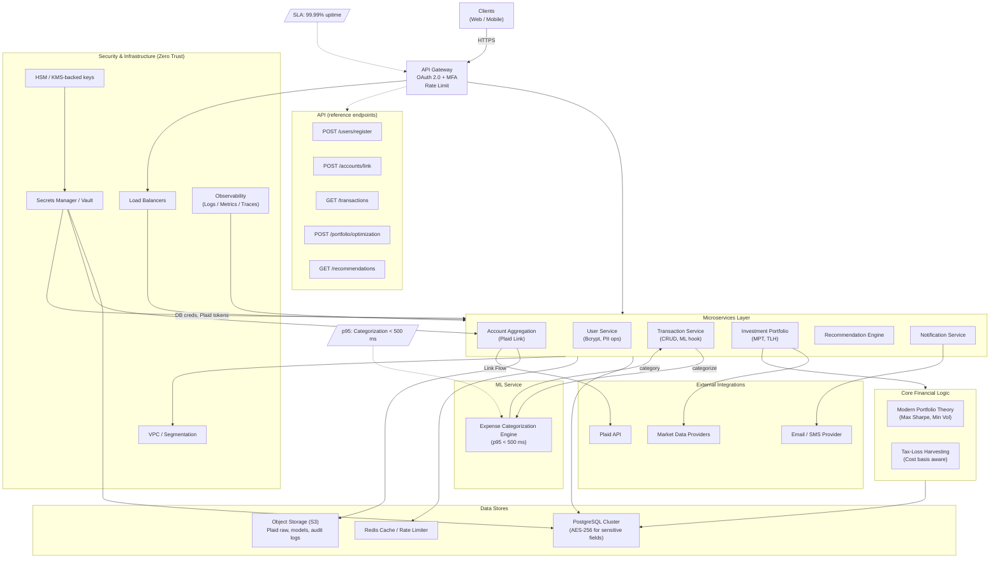

# Architecture Diagram (Mermaid, Portfolio View)

This diagram summarizes the Master FPF Architecture described in the documentation, emphasizing security-by-design, Zero Trust, and the non-functional targets defined for this project. It is intentionally concise for a portfolio repository; the full version and extended annotations are available in the complete documentation link in the README.[[4]](https://www.notion.so/Multi-Layer-Prompt-Structure-ZeTheta-Inter-279a56ae581780feba1aeea55bbace5b?pvs=21)[[5]](https://www.notion.so/Breakdown-Structure-Task-279a56ae5817809fb32ac99177639cc1?pvs=21)

Key Notes

- Non-functional targets:
    - SLA: 99.99% uptime for core backend services
    - Expense Categorization ML: p95 latency under 500 ms
- Security and compliance:
    - OAuth 2.0 on the gateway with MFA enforcement for sensitive actions
    - AES‑256 at rest for sensitive fields
    - Secrets in AWS Secrets Manager or HashiCorp Vault, with HSM-backed keys
    - Zero Trust network segmentation (VPC, SGs)
- Reference endpoints (summary):
    - POST /users/register
    - POST /accounts/link
    - GET /transactions
    - POST /portfolio/optimization
    - GET /recommendations

Export tip

- To include a static image in docs/System_[Architecture.md](http://Architecture.md), export this Mermaid diagram as PNG and save it as assets/diagrams.png. Then link to it from System_[Architecture.md](http://Architecture.md) so readers can see the visual without Mermaid rendering support.[[6]](https://raw.githubusercontent.com/alearisteguieta/Prompt-Engineering-FinTech-FPF/main/docs/System_Architecture.md)
